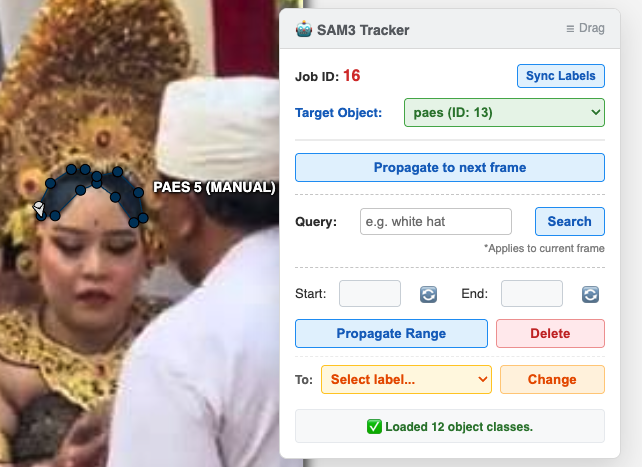

# CVAT SAM3 AI Tracker 🤖

[](https://opensource.org/licenses/MIT)



A powerful, seamless AI tracking and segmentation plugin for [CVAT](https://cvat.ai/) (Computer Vision Annotation Tool), powered by Meta's state-of-the-art **SAM 3 (Segment Anything Model 3) Video Tracker**. 

This tool bridges the gap between CVAT's web UI and local AI models, allowing you to automatically track, segment, and manage video annotations via a floating, draggable widget directly inside your browser.

## ✨ Key Features

* 🎯 **Smart Object Selection:** The UI automatically fetches your CVAT job labels and intelligently listens to your active selections in the CVAT sidebar, switching the target object seamlessly.
* 🎬 **Range Propagation:** Track an object from a `Start` frame to an `End` frame. The backend engine automatically assigns independent tracking sessions to handle multiple instances, disjointed polygons, and occlusions without memory crashes.
* 🔍 **Text-to-Mask (Text Prompting):** Segment objects on your **current frame** using natural language prompts (e.g., "white hat"). 
* 🗑️ **Range Deletion:** Clean up messy AI or manual annotations with a single click within a specific frame range to quickly retry prompts.
* 💾 **Auto-Save & Hard Reload Sync:** Automatically clicks CVAT's "Save" button to commit your manual edits before running AI inference. It then flawlessly refreshes the CVAT UI via URL parameters to fetch and display the new AI-generated polygons from the database.
* 🧠 **State Persistence:** Utilizes browser `localStorage` to remember your selected Object IDs and target frames even after the page reloads.

## 🏗️ Architecture

The project consists of two main components:
1. **Python Backend (FastAPI):** Communicates directly with the CVAT database via the official `cvat-sdk` and runs SAM 3 inference via Hugging Face `transformers`.
2. **JavaScript Frontend (Bookmarklet/Userscript):** Injects a draggable UI panel into the CVAT web interface, bypassing complex browser extension restrictions on local IPs.

---

## 🚀 Installation & Setup

### 1. Backend Server Setup
Ensure you have a machine with a compatible GPU (NVIDIA) to run SAM 3 smoothly.

1. Clone this repository:
   ```bash
   git clone https://github.com/zhixinma/CVAT-SAM3-AI-Tracker
   cd cvat-sam3-smart-tracker
   ```
   
2.  Install the required Python packages:
    ```bash
    pip install fastapi uvicorn transformers torch cvat-sdk opencv-python pillow accelerate pydantic
    ```
3.  Open `cvat_sam.py` and update the CVAT configuration variables to match your environment:
    ```python
    CVAT_URL = "http://YOUR_CVAT_IP:8080"
    USERNAME = "your_username"
    PASSWORD = "your_password"
    VIDEO_DIR = "/path/to/your/cvat/video/directory"
    ```
4.  Start the FastAPI server:
    ```bash
    uvicorn cvat_plugin_server:app --host 0.0.0.0 --port 8081
    ```

### 2. Frontend Plugin Setup (Browser)

To inject the control panel into CVAT, we use **Tampermonkey**, a popular userscript manager. This allows the UI to load automatically alongside your CVAT tasks.

1. Install the [Tampermonkey](https://www.tampermonkey.net/) extension for your web browser.
2. Click the Tampermonkey extension icon in your browser toolbar and select **Create a new script...** (or go to the Dashboard and click the `+` tab).
3. Delete any default code provided in the editor.
4. Copy the entire JavaScript code from `frontend_userscript.js` (making sure to include the `// ==UserScript==` header block at the top) and paste it into the editor.
   *(Note: Remember to update the `API_BASE` IP address inside the script if your backend server runs on a different machine).*
5. Save the script (`Ctrl + S` or `Cmd + S` / **File** -> **Save**).
6. Open or refresh your CVAT Job webpage. The `🤖 SAM3 Tracker` panel will automatically appear!

*(**Troubleshooting Note:** If the panel does not appear on local HTTP IP addresses, ensure the script header includes `@include *` as provided, which helps bypass strict browser extension restrictions on local networks).*

-----

## 🕹️ How to Use

1.  Open your CVAT Task/Job in the browser.
2.  Click the `🤖 Start SAM3 Plugin` bookmark in your bookmarks bar. The floating panel will instantly appear.
3.  Draw a starting bounding box or polygon for your target object in CVAT.
4.  The plugin will automatically detect your actively selected object. (You can also manually click **Sync Labels**).
5.  Choose your action:
      * **Propagate to next frame:** Moves the mask forward by exactly 1 frame.
      * **Search (Text Query):** Type a text prompt and let SAM 3 find the object in the *current* frame.
      * **Propagate Range:** Enter a Start and End frame, then let the AI track the object across the sequence.
      * **Delete:** Remove all annotations for the target object within the specified frame range.
6.  The plugin will automatically save your current work, trigger the backend AI, and reload the page to display the results\!

## 🤝 Contributing

Contributions, issues, and feature requests are welcome\! Feel free to check the issues page.

## 📄 License

This project is licensed under the [MIT License](https://www.google.com/search?q=LICENSE).
